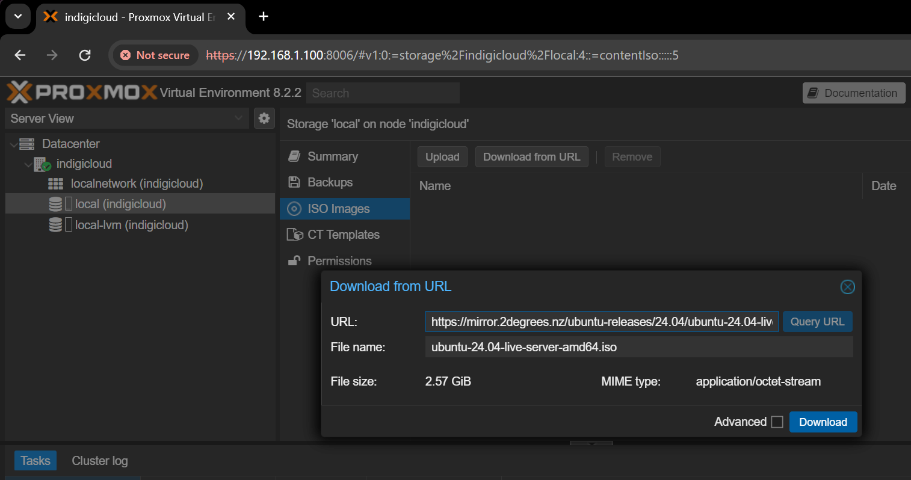
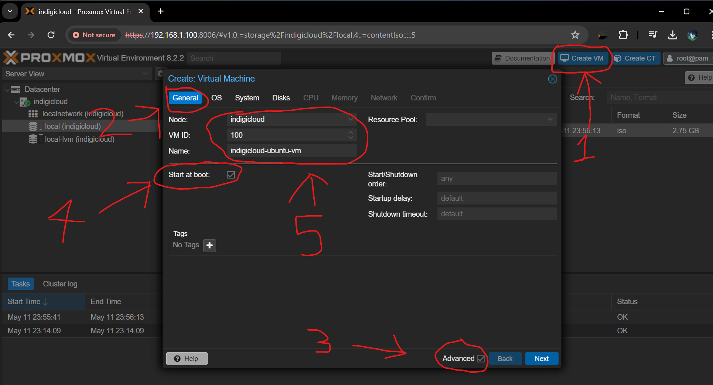
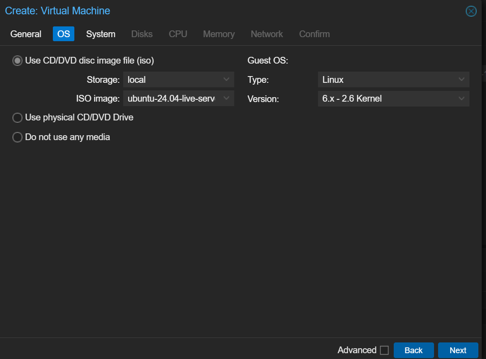
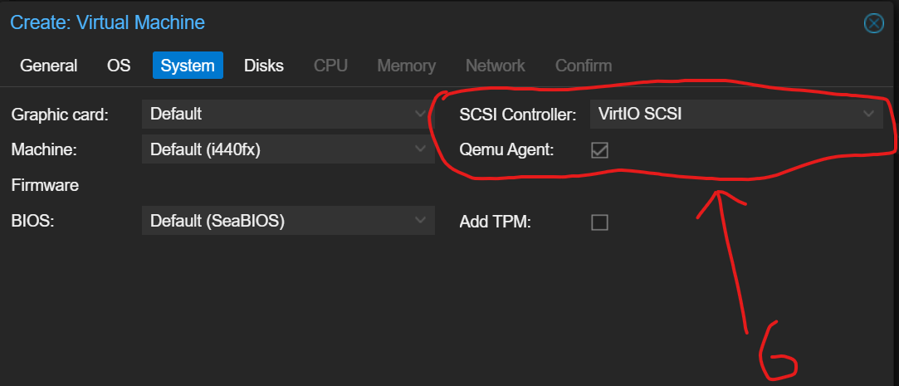
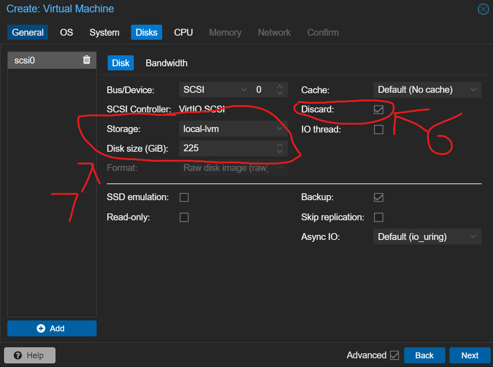
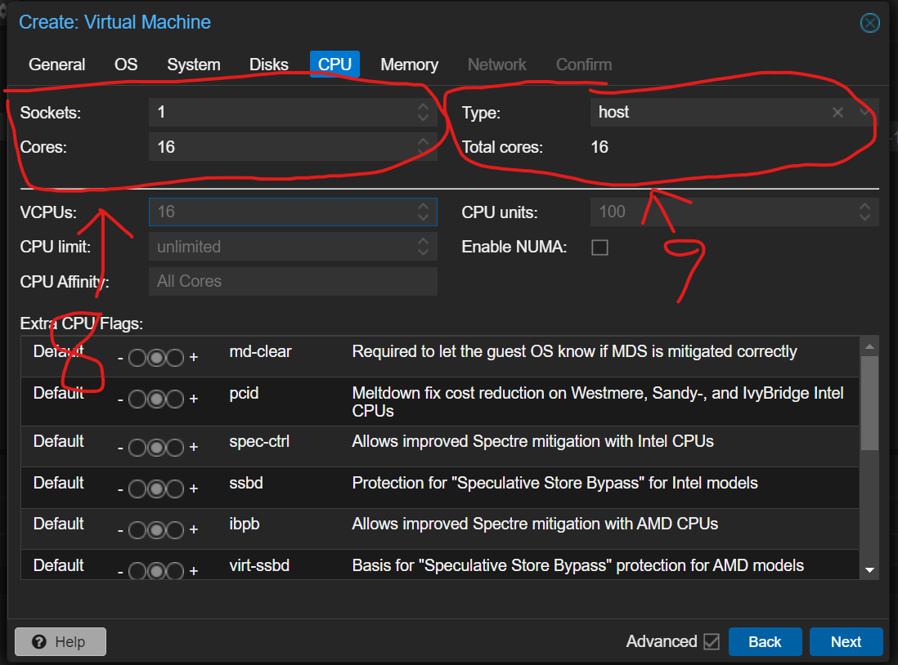
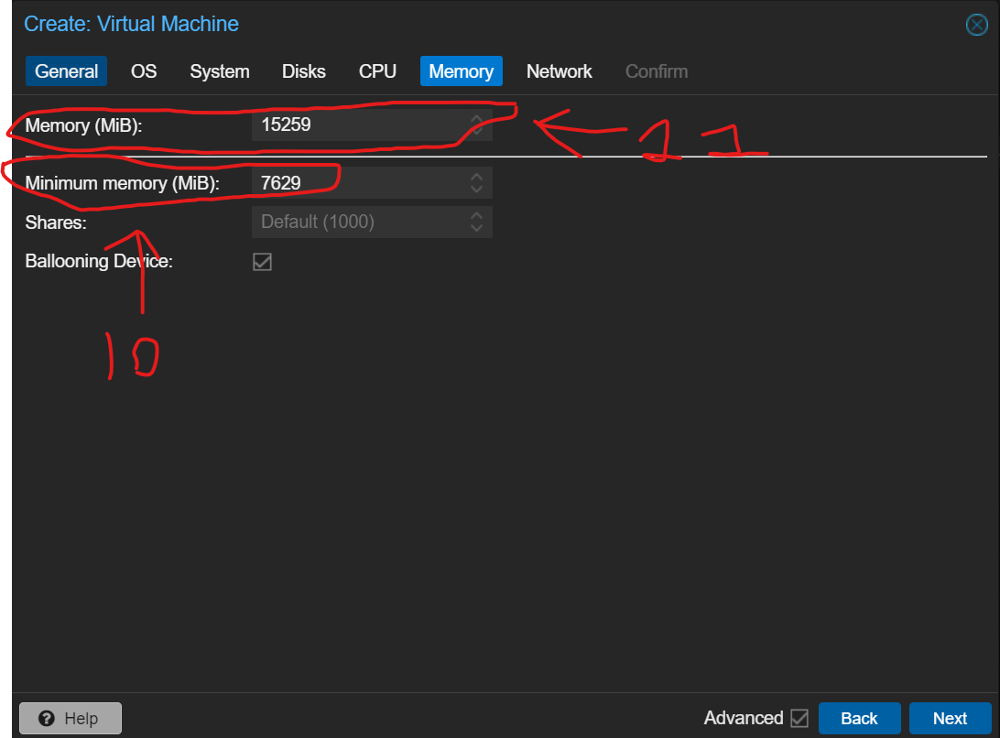
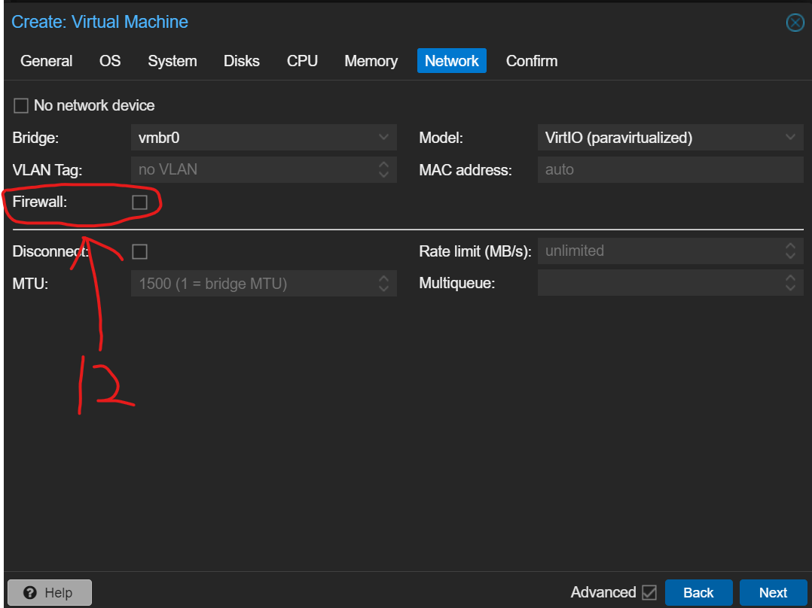
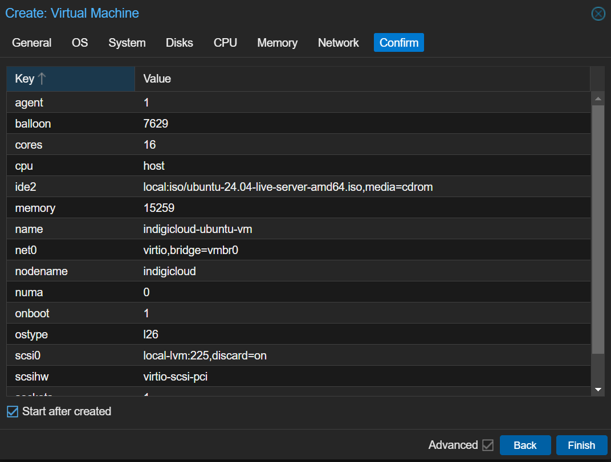
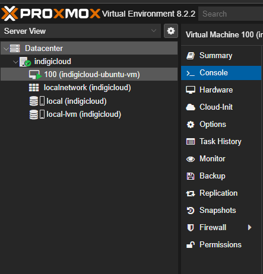

# Custom Proxmox ISO Install Process

## Introduction

## Prerequisites

## Step 1: Downloading the ISO and Creating the VM

In this case I will be using ubuntu 24.04.

Firstly I will download the Ubuntu server 24.04 ISO, this can be done be done by vising the ubuntu repository and either by downloading to you administration computer, or you can copy the URL of the download and paste it directly into your server so that you cut out the steps of wasting time and space on your administrative computer and directly send the ISO from ubuntu's server (in this case a mirror by 2degrees) directly to the proxmox install.

Firstly we are going to click the advanced checkbox to see all options,
Now we are going to create the VM, we want to select the ``Start at boot`` option which makes the VM auto start when the server is turned booted alongside setting the name of the VM.

In the. OS tab for creating the VM we want to select the VM ISO and selecting the type and kernel version (ideally latest)

In the System tab we want to select the following settings for SCSI controller and select Qemu Agent.

Now click the disks option, since this is going to be our main VM I will allocate half of our available storage to the VM, 225 GiB should be plenty for the VM while also disabling the Cache feature as we are using an NVME ssd for the boot where using a cache can cause reduced performance. We only want to use a cache if we are running the VM on a hard drive which is unlikely with modern hardware.

Now on the CPU section we want to allocate 16 cores as we have 16 threads available on our CPU, this will provision the VM to use 100% of our systems resources, however with VMs we can always over provision to a common amount of 280% as all VM's will never be maxing out CPU usage, we also want to select Host such that we are passing through the CPU features/instructions that the host system has access to.

For memory as we have 32GB of RAM installed in the System I will be allocating half of that which should be plenty for our usecase, I have also enabled ballooning with the minimum memory allocation being 8GB allowing for a bit of overprovisioning in the future if required.

For the Network setup I will be leaving most of it default however will be disabling the proxmox firewall, this is because we will be using a firewall on the VM itself which will integrate better with our ansible playbooks for automated firewall configuration.

Lastly we confirm the creation of the VM:

Our VM has been created!

## Step 1: Setting up the Ubuntu VM

Under the server ID (100) and then under the Console tab we get a "video out" of the ubuntu VM, this is where we can setup the ubuntu VM:

For the next steps on installing Ubuntu on the newly created VM, refer to [Step 3: Ubuntu Installation](/Installing-Ubuntu/Installing-Ubuntu.md#step-3-ubuntu-installation) in the `Installing-Ubuntu.md` guide.

 While those instructions are for installing ubuntu on a dedicated server, the instructions are completely identical for a VM setup.