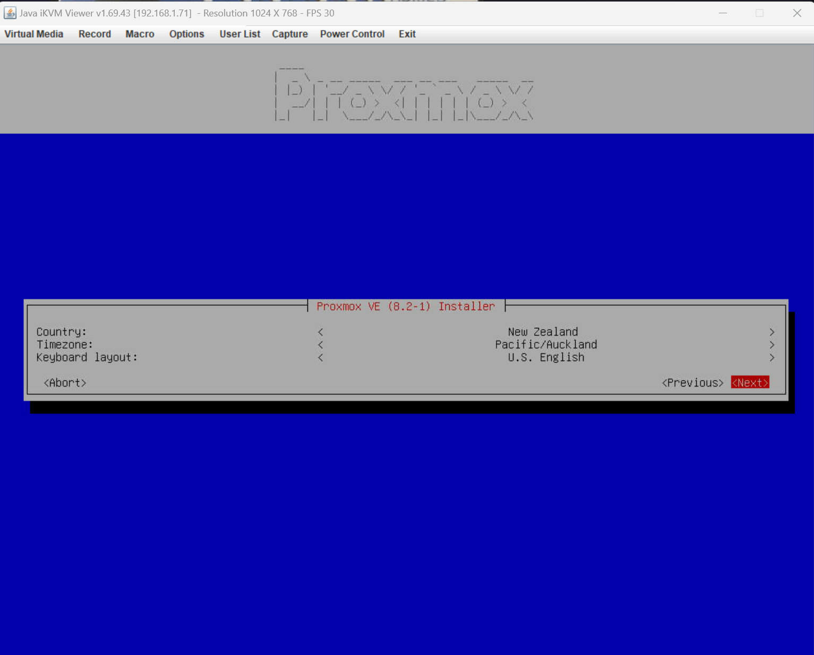
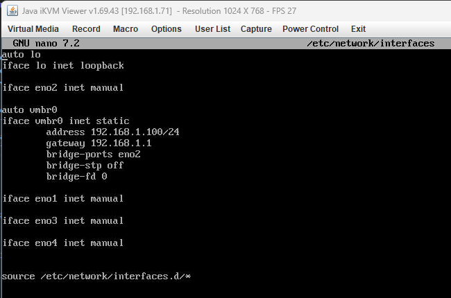

# Custom Proxmox ISO Install Process

## Introduction


## Prerequisites


## Step 1: Connecting to the server via IPMI

In this step we are connecting to the server via IPMI, this is important as IPMI allows us to access the server as if we are next to it with a display connected without having to do so, this is because the motherboard has a graphics chip in it to output video, this is also why we notice that on this particular supermicro server (E301-9D-8CN4) there is a video out (VGA) even though the CPU does not have integrated graphics within its EPYC 3251 CPU. IPMI allows us to access the machines video out via the IPMI thus allowing us to configure and setup the server while also allowing us to perform actions like a full system reboot or shutdown if the operating system (in this case Proxmox) hangs or crashes.


## Step 1: Downloading the Proxmox ISO

To download the Proxmox ISO, follow these steps:

1. Open your web browser and navigate to the Proxmox official website at `https://www.proxmox.com/en/downloads`

2. In the "Proxmox VE" section, click on the "ISO Images" tab.

3. Look for the version you want to download, in this case, version 8.2. Click on the "Download" button next to it.

4. Save the ISO file to your desired location on your computer.


## Step 2: Connecting to IPMI

Firstly, we need to plug in the server into a router that is connected to the administration computer, or into a switch so that the computer doing administration can talk to the servers IPMI.

Secondly, we need to connect to the IPMI on the server, this can be found by going into your routers admin section and then looking at the connected devices list. as we can see in the following image, since i just plugged the server into the IPMI port its uptime is 0 hours and we can see which port it was plugged into on the router:


Now to connect to the IPMI, on the administration computer that is connected to the same network, we can enter the IP like so `https://192.168.1.71/`

In the following image we can see the IPMI webserver responding with a login page:


For older supermicro servers the default login is ``ADMIN/ADMIN`` however for newer supermicro servers while the username is ``ADMIN`` (case sensitive), the password is listed on the server via a sticker.

As we can see in the following image, the very bottom sticker contains the password for the IPMI:


This is how the IPMI webui looks when logged in:


We want to acess the IPMI console so that we can install proxmox so we want to go to the remote console page:


Then we want to ensure java is installed on the administration system as the IPMI console uses Java, this can be downloaded and setup by downloading the Java installer at ``https://www.java.com``

After that we want to launch the console, this will download a java file to your machine.


After opening the ``launch.jnlp`` file there will be various security prompts, as we know the origin of this file it is okay to click continue and accept all the prompts, it is possible that windows defender may automatically remove this file, and thus it is important to disable windows defender or whatever antivirus software is installed on the administration system temporarily due to the IPMI Java app throwing false positives.


After opening the IPMI console we will now be able to see a live representation of our servers video out:


We have now successfully connected to the IPMI of our supermicro server.


## Step 3: Installing Proxmox

Now we want to attatch the ISO downloaded previously:
;


Select ISO image, then click open image and select the ISO file for ubuntu that was previously downloaded to your computer.

Then click plug in, this will make the ISO appear to the server as a bootable CDROM that has been attatched over the network.


After attatching the CDROM the server needs to be rebooted to be able to see the bootable CDROM, this can be done by physically turning the server off and on, or via the IPMI like so:


Now if the SSD has no existing OS installed then the proxmox installer should automatically start, if there already is an OS installed then while the system is rebooting and at the bios screen, consecutively until the boot menu appears click ``f11`` on the administration computer, after the boot menu displays from the BIOS, we want to select the UEFI virtual CDROM option as that's what how our ISO is connected via the IPMI.

After that we should be in the proxmox installation screen, here we want to select the terminal UI which was thankfully added in version 8.2 meaning we do not require a graphics card or integrated graphics to setup proxmox (this was a previous requirement in older versions).


Accept the eula:


Select our installation disk, in this case it is the NVME SSD that is installed:


Now select the country, timezone and keyboard layout. I have selected what best represents our server:



We will use [Nayuki Project](https://www.nayuki.io/page/random-password-generator-javascript), this will use local javascript on the computer to generate a secure password (this page can also be downloaded to prove it can run without internet showcasing it doesn't make any calls to a server with the credentials), I have chosen a good middle ground for password length and security, ensuring that it's easy to type into the IPMI yet secure at an estimated 700 billion years to crack the password:


Here I enter the credentials generated via ``Nayuki Project`` and the admin email which will be used to login (this email currently is not active however with control of the domain can be at a later date):


Since this machine isn't connected to the network yet it will be setup with defaults, to be setup at a later date:


Final installation screen, i have deselected automatic boot so that i can disconnect the virtual CDROM ISO:


Installation complete:


Plug out the virtual CDROM ubuntu ISO as it is no longer needed and then select reboot


On boot we can see that proxmox has been installed:


## Step 4: Setting up the network

We need to edit the network setup.

After plugging in the RJ45 ethernet cable to one of the four ports on the server we can then see which network interface it corresponds to on the server.

In the following image we can see that the interface ``eno2`` has a state of "UP" when we check it via ``ip a`` and this means it has an active link established with the router or network switch.


Now we are going to want to configure either DHCP or a Static IP, I have chosen to go with a static IP in the local subnet as this guide will then be slightly more applicable for the enviroments this server will be eventually deployed in.

We are going to open the interfaces file using the text editor "nano" with:
```
nano /etc/network/interfaces
```

Here I have set every interface to manual, however for the vmbr0 interface which is what Proxmox uses, we will set it to bridge the eno2 interface, the vmbr0 interface is also where we set the static IP in the local subnet where I have chosen ``192.168.1.100/24``, the IP will have to depend on the subnet mask of your network which for my router is ``255.255.255.0`` also known as a /24 network giving 254 usable IP addresses which is more than enough for home networks, however different masks can be used allowing more addresses for more commercial setups.

I have then set the gateway to ``192.168.1.1`` which is the IP of my router in the subnet.




now we can test if the network is working, an easy way to do this is ``ping google.com`` and if we see a response and no errors then internet access has been established.


## Step 5: Connecting to the Proxmox configuration webserver

Now that proxmox is installed we can then access the webserver!

This can be done at port ``8006`` of the server IP which in our case I set it to ``192.168.1.100``

Here we can access it in our browser at ``https://192.168.1.100:8006``:


Now we can login with the password we setup earlier and the user ``root`` :


